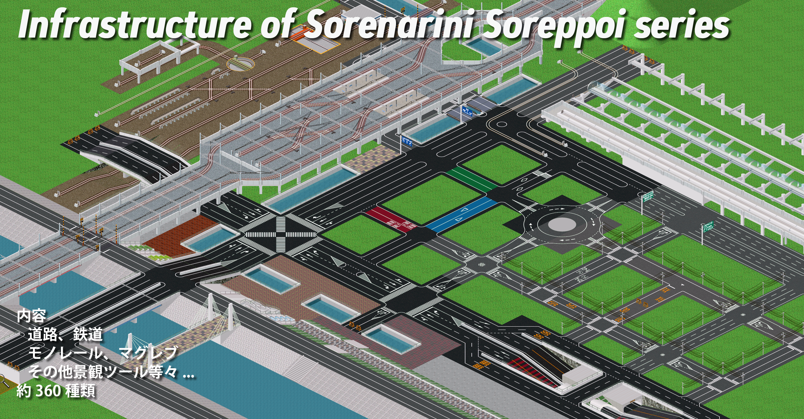

# Infrastructure of Sorenarini Soreppoi series
それなりにそれっぽいインフラアドオン集



## 導入

以下のリリース一覧から `release.zip` をダウンロードし、解凍したファイルを指定フォルダにコピーして下さい。

https://github.com/128na/iss/releases

- アドオン本体
  - `dist/pak***/***.pak` -> `addons/pak***/`
- 翻訳ファイル（日本語、英語のみ対応）
  - `dist/text/***.tab` -> `addons/pak***/text/***.tab`

## 資料

- [アドオン一覧](./addons)
- [建設テクニック集](./technique)
- [仕様書](./spec)

## license

<a rel="license" href="http://creativecommons.org/licenses/by/4.0/"></a><br />この 作品 は <a rel="license" href="http://creativecommons.org/licenses/by/4.0/">クリエイティブ・コモンズ 表示 4.0 国際 ライセンス</a>の下に提供されています。

## 64で使用する場合

waさん作成の `resizeobj` （v1.6以上）を使用することで64用に変換できます。
https://github.com/wa-st/resizeobj/releases/tag/v1.6.0

内部的には256サイズでpak化されているため、返還後のサイズには128を指定します。
```
resizeobj.exe -W=128 iss*.pak
```
