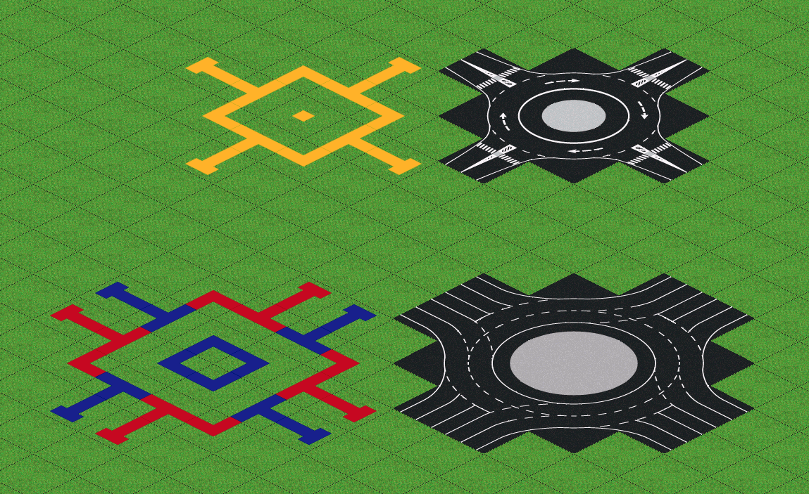
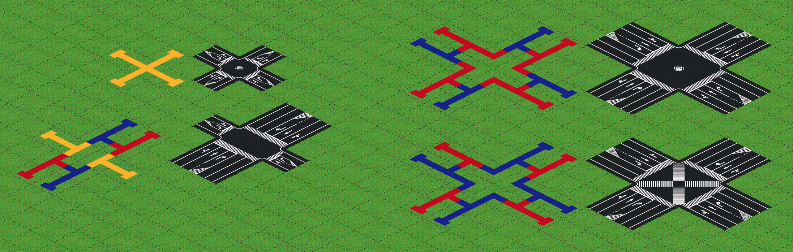
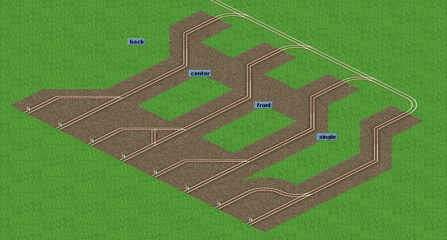
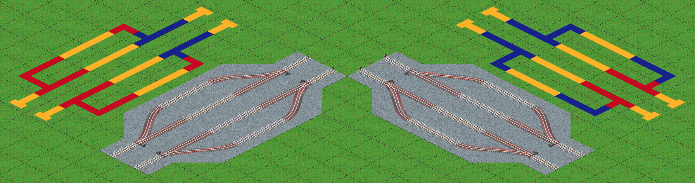
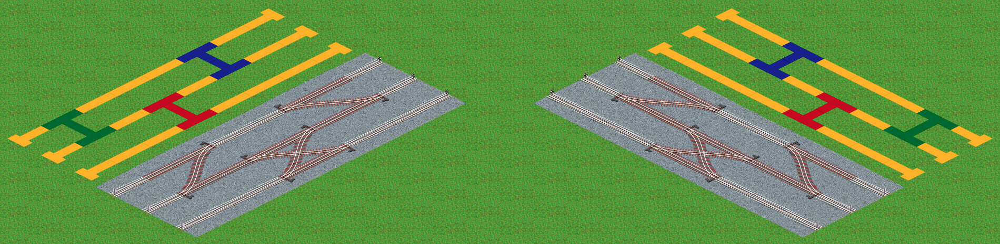
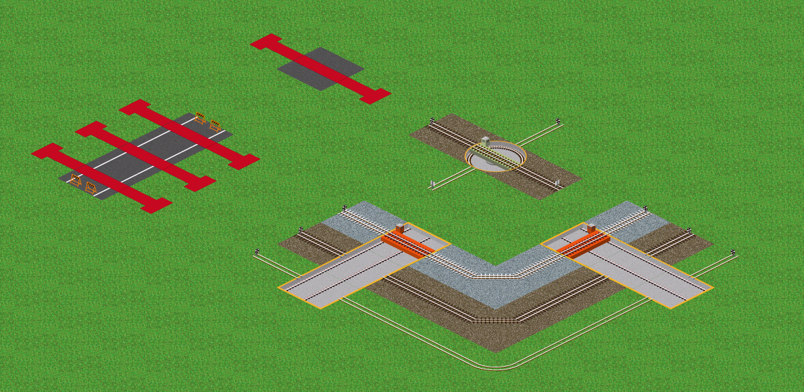
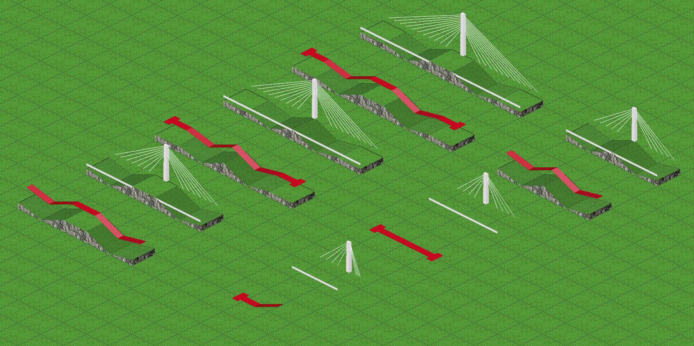
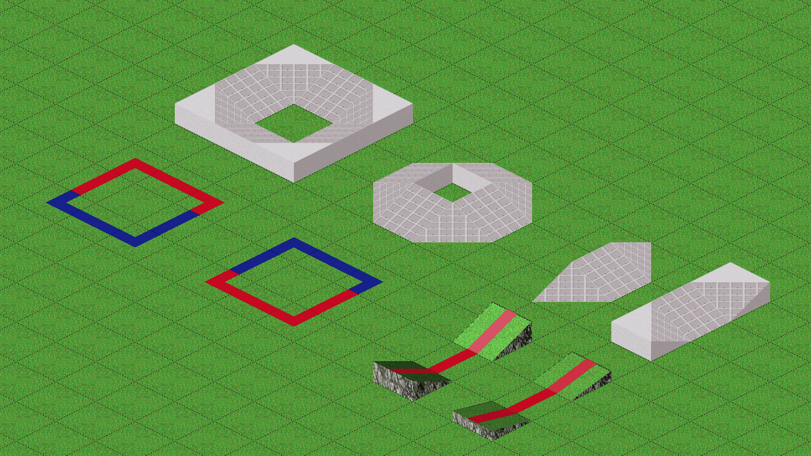

# 建設テクニック集

## 道路系

### ラウンドアバウト

### 交差点

### 中央分離帯

## 鉄道系

### 線路とポイント挙動

地面タイルの配置違いで奥、手前、中央、単線用があります。
それぞれポイント画像の挙動が異なります。詳細仕様は [諸元](../spec/way) を確認してください。

### ゆるめ分岐

2x2タイルを使用した角度の緩い分岐です。

### 転車台とトラバーサー

道路ツールを使用しています。

## その他
### 橋

- 長さ５の橋には橋脚パーツが含まれています
- 長さ１の橋には路盤のみのタイルが含まれています

## 法面

